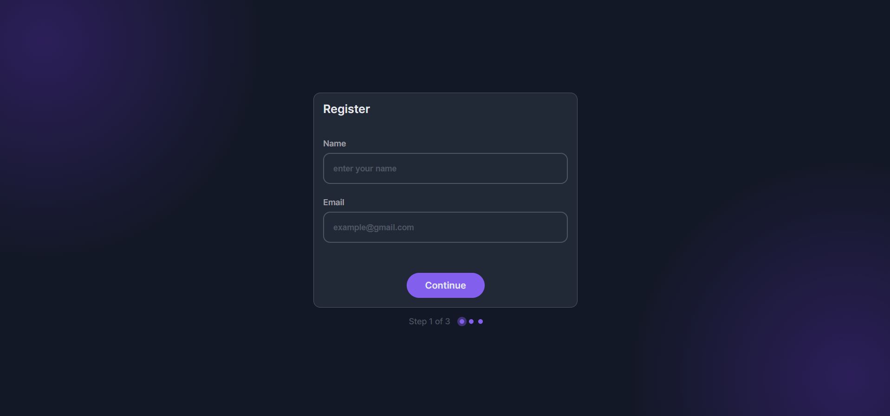

# Multi-Step Form

Este proyecto es un formulario de registro interactivo de múltiples pasos, diseñado con **HTML**, **CSS** y **JavaScript**. Incluye validaciones en el lado del cliente y una previsualización final de los datos antes de enviarlos al servidor.

## Vista Previa



Puedes ver la versión demo en vivo aquí: [Multi-Step Form](https://ibrahim-003.github.io/Multi-Step-Form/)

## Características

- **Estructura de Múltiples Pasos**:
  - El formulario está dividido en tres secciones: Registro, Selección de Temas y Resumen.
  - Cada paso tiene navegación dinámica para avanzar al siguiente o completar el formulario.
- **Validación en el Cliente**:
  - Verificación de campos como nombre, email y selección de temas con mensajes de error interactivos.
- **Previsualización Final**:
  - En el paso de resumen, se muestran los datos ingresados, permitiendo al usuario confirmar antes de enviar.
- **Barra de Progreso**:
  - Indicador visual del progreso del formulario en la parte inferior de la página.
- **Responsive Design**:
  - Diseño adaptable a dispositivos móviles y de escritorio para una experiencia fluida.

## Estructura de Archivos

```
|-- index.html                 # Página principal
|-- assets/
    |-- css/
    |   |-- reset.css          # Estilos para reinicio
    |   |-- styles.css         # Estilos personalizados
    |-- images/
    |   |-- desktop-preview.png # Captura de pantalla
    |   |-- logo.svg           # Logo del proyecto
|-- js/
    |-- index.js               # Lógica y validación del formulario
|-- README.md                  # Descripción del proyecto
```

## Instalación

1. Clona este repositorio en tu máquina local:
   ```bash
   git clone https://github.com/Ibrahim-003/Multi-Step-Form.git
   ```
2. Abre el archivo `index.html` en tu navegador para visualizar el proyecto.

## Tecnologías Utilizadas

- **HTML5**: Estructura semántica del formulario y la página.
- **CSS3**: Estilización, incluyendo diseño adaptativo y barra de progreso.
- **JavaScript**:
  - Navegación entre pasos del formulario.
  - Validaciones dinámicas de los campos.
  - Previsualización de datos en el paso final.

## Autor

Este proyecto fue desarrollado por [Ibrahim Almeyda](https://github.com/Ibrahim-003) como parte de un desafío personal para mejorar habilidades en desarrollo frontend. 
